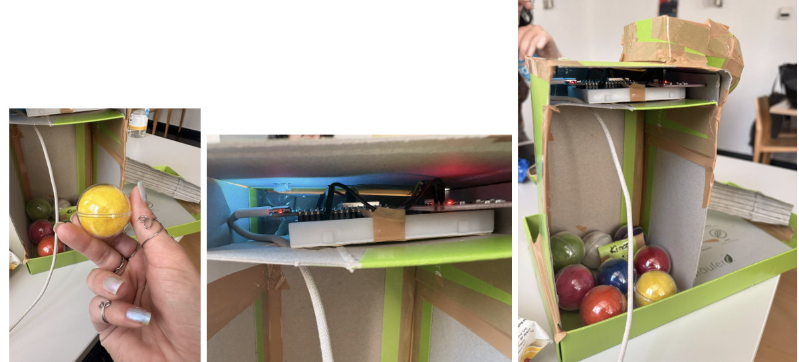
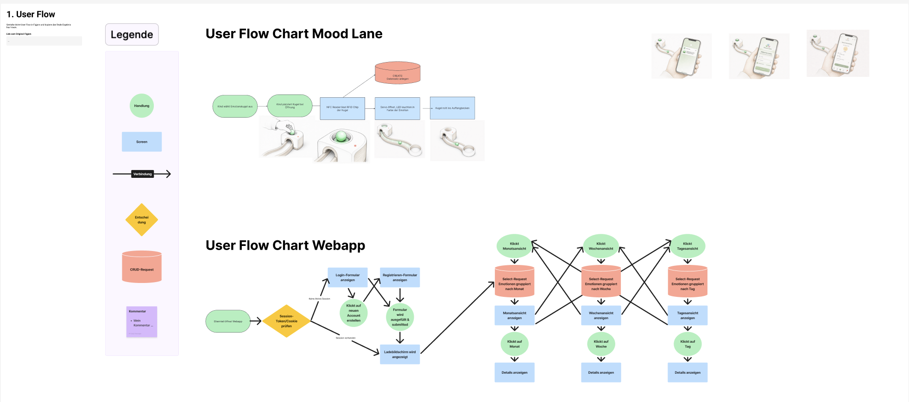
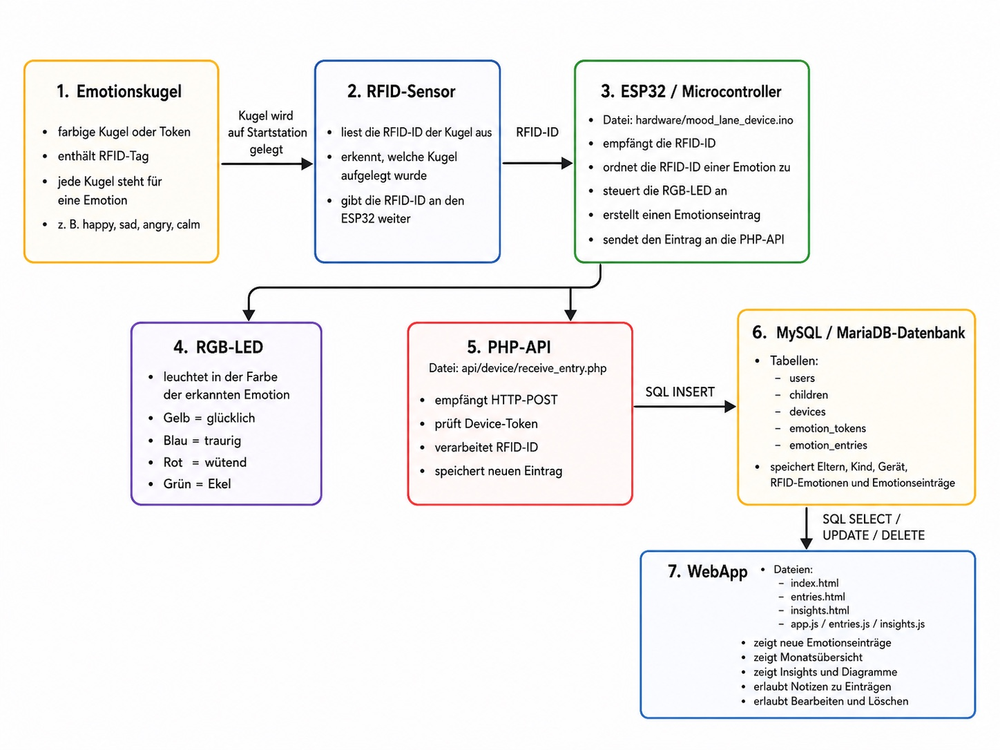
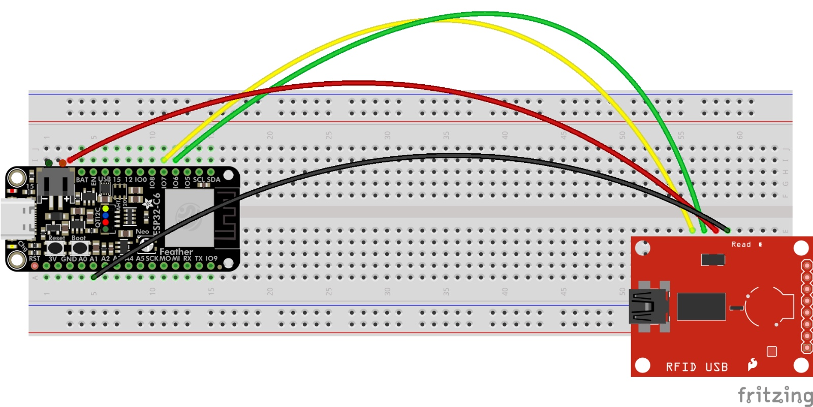
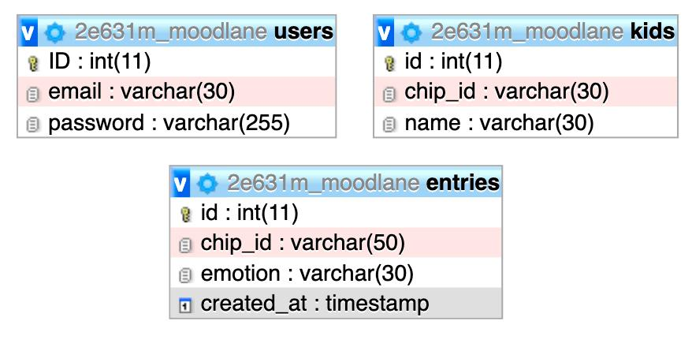

# Mood Lane
Mood Lane macht Emotionen sichtbar. Durch die Kombination einer spielerischen Murmelbahn mit einer digitalen Auswertung hilft Mood Lane Kindern dabei, ihre Gefühle bewusst wahrzunehmen und auszudrücken. Gleichzeitig erhalten Eltern wertvolle Einblicke in die emotionale Entwicklung ihrer Kinder. So entsteht ein einfaches und motivierendes Werkzeug für mehr Verständnis, Kommunikation und emotionale Förderung im Familienalltag.

## Kurzbeschreibung des Projekts

* **Modul:** *Interaktive Medien 4 an der Fachhochschule Graubünden (FS26)* 
* **Themenfeld:** *IoT-Applikation zum Thema Eltern mit kleinen Kindern*  
* **Name des Projekts:** *Mood Lane* 
* **Team Physical Computing:** *Natacha-Anina Krenger, Quincy Enoma*
* **Team WebApp:** *Alicia Gregorini, Maya Nikita Baumann*

Mood Lane ist ein interaktives Physical-Computing-System, das Eltern dabei unterstützt, die Emotionen ihrer Kinder besser zu verstehen und nachzuvollziehen. Durch eine spielerische Kombination aus einer physischen Murmelbahn und einer Webapplikation können Kinder ihre aktuelle Emotion erfassen und dokumentieren. Die erfassten Daten werden gespeichert und für Eltern übersichtlich visualisiert.

Das System richtet sich insbesondere an jüngere Kinder, die ihre Gefühle noch nicht klar verbal ausdrücken können. Durch die tägliche Nutzung lernen sie, Emotionen bewusst wahrzunehmen, zu benennen und einzuordnen. Gleichzeitig erhalten Eltern wertvolle Einblicke in die emotionale Entwicklung ihrer Kinder.

## Problem & Lösung

### Welches Problem im Alltag von Eltern mit kleinen Kindern wird gelöst? <br>
Viele Kinder im jungen Alter können ihre Emotionen noch nicht ausreichend kommunizieren oder einordnen. Für Eltern ist es deshalb oft schwierig zu verstehen, weshalb ein Kind auf bestimmte Situationen besonders stark reagiert oder scheinbar keine erkennbare Reaktion zeigt.

Dadurch können Missverständnisse entstehen, und wichtige Hinweise auf das emotionale Wohlbefinden eines Kindes bleiben möglicherweise unbemerkt.

### Was ist der „Sinn und Zweck“ des Systems? <br>
Mood Lane ermöglicht es Eltern, die Emotionen ihrer Kinder über einen längeren Zeitraum zu erfassen und nachzuverfolgen. Dadurch können emotionale Muster erkannt und Gespräche über Gefühle gefördert werden.

Kinder lernen mithilfe eines spielerischen Ansatzes, ihre Emotionen zu identifizieren und verschiedenen Gefühlszuständen zuzuordnen. Die Gestaltung orientiert sich dabei an den bekannten Emotionen aus dem Disney-Pixar-Franchise Inside Out. Unterschiedlich farbige Emotionskugeln repräsentieren verschiedene Gefühle und schaffen einen hohen Wiedererkennungswert.

Die physische Interaktion mit der Murmelbahn motiviert Kinder zur regelmässigen Nutzung des Systems. Gleichzeitig entsteht eine einfache und verständliche Methode, Emotionen im Alltag zu dokumentieren.



### UX & Konzeption

*In diesem Teil werden die gemeinsamen Schritte aus der UX-Abgabe dokumentiert, damit sich hier alles vollständig an einem Ort befindet (betrifft WebApp und Physical Computing)*

* **Figma:** [Link zum Figma](https://www.figma.com/design/sp9aHmOb6vmgzlygEPm0ih/Mood-Lane-UX?node-id=30-97&p=f&t=RcCNdvFUaCcnoKYK-0)
* **User Flow \+ Screen Flow** (Screenshot aus Figma)


### Welche Features waren angedacht? <br>
* Physical Computing
* Murmelbahn mit unterschiedlich farbigen Emotionskugeln
* Scanner zur Erkennung der gewählten Emotion
* Personalisierte Chip-Karten zur Identifikation verschiedener Kinder
* Statusanzeige mittels Lampe zur Bestätigung eines erfolgreichen Scans
* Webapplikation
* Übersicht über alle erfassten Emotionseinträge
* Darstellung der Daten nach Tag, Woche, Monat und Jahr
* Detailansicht einzelner Einträge und Zeiträume
* Registrierung neuer Kinder/Personen
* Löschen bestehender Kinder/Personen

### Erweiterungsidee

Zusätzlich wurde ein digitales Emotionstagebuch konzipiert. Nach dem Scannen einer Emotion sollte automatisch eine Audioaufnahme starten, in der das Kind kurz erklärt, weshalb es diese Emotion gewählt hat. <br>

Beispielsweise könnte ein Kind erläutern, weshalb es sich geekelt hat oder warum es besonders glücklich war. Dadurch wären neben den Emotionen auch deren Ursachen dokumentiert worden. Dies könnte man in einer zukünftigen weiterentwickelten Version von Mood Lane miteinbauen.

### Nicht umgesetzte Features

Das geplante Audioaufnahme-Feature wurde nicht umgesetzt. <br>

Der Fokus lag während der Entwicklung auf der erfolgreichen Umsetzung der Kernfunktionalitäten des Systems. Die Aufnahme, Speicherung und Verwaltung von Audiodateien hätte zusätzliche technische Komplexität verursacht und den zeitlichen Rahmen des Projekts überschritten. <br>

Darüber hinaus hätten wichtige konzeptionelle Fragen geklärt werden müssen, beispielsweise: <br>

* Ist eine Sprachaufnahme verpflichtend oder freiwillig?
* Wie lange darf eine Aufnahme dauern?
* Wie wird mit sehr jungen Kindern umgegangen, die sich noch nicht verbal ausdrücken können?

Da diese Fragen weitere Anpassungen der Systemarchitektur erfordert hätten, wurde entschieden, den Fokus auf die spielerische und unkomplizierte Erfassung von Emotionen zu legen.

## Setup

* **WebApp:** [Link zur Website](https://moodlane.aliciagregorini.com/login.html)  
* **Video-Dokumentation:** [Link zum Video auf Youtube](https://www.youtube.com/watch?v=I8A1v1qAnEo) 

### Installationsanleitung WebApp
1. Benötigt wird ein Webhost wie z.B. Infomaniak
2. Darauf muss ein php-Webserver und eine SQL Datenbank aufgesetzt werden
3. Das github Repo muss geklont werden und auf den php-Webserver geladen werden
3. Im phpAdmin der Datenbank muss das moodlane.sql file importiert und ausgeführt werden um die Datenbank zu erstellen 
4. Im Repo muss im Ordner system ein file config.php mit folgendem Inhalt erstellt werden und die Credentials eingefügt werden:
   ```php
   <?php
   // config.php
   $host = '';
   $db   = '';  // Change to your DB name
   $user = '';   // Change to your DB user
   $pass = '';       // Change to your DB pass if needed
   try {
     $dsn = "mysql:host=$host;dbname=$db;charset=utf8mb4";
     $pdo = new PDO($dsn, $user, $pass);
     // Optional: Set error mode
     $pdo->setAttribute(PDO::ATTR_ERRMODE, PDO::ERRMODE_EXCEPTION);
   } catch (Exception $e) {
      echo "Database connection error: " . $e->getMessage();
      exit;
   }
   ?>
   ```
5. Nachdem auch der physical Teil aufgesetzt ist kann aus der Datenbank in der Tabelle entries die chip_id der Kinder-Karten kopiert werden und damit im Frontend ein neues Kind erstellt werden.

## Bauanleitung Physical Computing

**Was muss ich wie bauen, verbinden, installieren?** <br>  
Man braucht folgende Hardware:
* Steckplatine
* ESP32-C6 Mikrocontroller
* PN532 NFC/RFID Reader
* 8 NFC-Emotion-Tags, 2 NFC-Profil-Chips
* Jumper-Kabel (mindestens 4 Stück: rot, schwarz, grün, gelb)
* Stromquelle
Zunächst steckt man den Mikrocontroller auf die Steckplatine, so. damit auch der NFC Reader Platz hat. Auf dem roten PN532-Board (Reader)  gibt es kleine DIP-Schalter. Diese müssen vor dem Einstecken korrekt gesetzt werden: Schalter 1 auf ON, Schalter 2 auf OFF. 

**Alle Verbindungen werden über die Steckplatine hergestellt. Die 4 Kabel verbinden ESP32-C6 und PN532:**

| Kabel | ESP32-C6 Pin | PN532 Pin |
| :--- | :--- |:--- |
| Rot | 5V | VCC |
| Schwarz | G (GND) | GND |
| Grün | GPIO6 | SDA |
| Gelb | GPIO7 | SCL |

Software installieren:
In der Arduino IDE müssen diese Bibliotheken über den Library Manager installiert werden: Adafruit PN532 (by Adafruit), Arduino_JSON (by Arduino). Als Board wird ESP32C6 Dev Module unter esp32 by Espressif ausgewählt.

Im Arduino-Sketch werden WLAN-Name, Passwort und die Server-URL eingetragen. Beim Hochladen muss die BOOT-Taste gedrückt gehalten werden, bis “Uploading…” erscheint.

Jeden NFC Tag einzeln auf den PN532 halten, die UID erscheint im Serial Monitor. Diese UIDs werden im Code in das emotions[]-Array eingetragen und der Code erneut hochgeladen.

### Aufbau
1. **Startstation bauen**
Die Startstation enthält die RFID-Lesefläche. Dort wird die Kugel aufgelegt oder durch eine definierte Stelle geführt.
2. **RFID-Reader montieren**
Der Reader wird unter oder direkt bei der Startmulde platziert. Der Abstand zur Kugel muss klein genug sein, damit der RFID-Chip zuverlässig gelesen wird.
3. **Emotionskugeln vorbereiten**
Jede Kugel erhält einen RFID-Tag. Jede RFID-ID wird im System einer bestimmten Emotion zugeordnet.
4. **LED-Feedback integrieren**
Eine RGB-LED wird an oder nahe der Startstation platziert. Sobald eine Kugel erkannt wurde, leuchtet die LED in der passenden Farbe der Emotion auf.
5. **Murmelbahn bauen**
Die Bahn führt von der Startstation zum Auffangbecken. Sie dient primär als haptisches und spielerisches Interface.
6. **Auffangbecken integrieren**
Am Ende der Bahn landet die Kugel im Auffangbecken. Die emotionale Erfassung erfolgt bereits über den RFID-Sensor an der Startstation.*
7. **Komponentenplan**
Der Komponentenplan zeigt, wie die physischen und digitalen Bestandteile von Mood Lane zusammenarbeiten. Im Zentrum steht der ESP32 als Verbindung zwischen der physischen Murmelbahn und der WebApp.

### Komponentenplan
Der Komponentenplan zeigt, wie die physischen und digitalen Bestandteile von Mood Lane zusammenarbeiten. Im Zentrum steht der ESP32 als Verbindung zwischen der physischen Murmelbahn und der WebApp.


**Die eingesetzten Komponenten**

Die eingesetzten Komponenten umfassen sowohl physische Bauteile als auch digitale Systembestandteile. Zu den physischen Komponenten gehören die Emotionskugeln mit RFID-Tags, der RFID-Sensor, der ESP32 und die RGB-LED. Zu den digitalen Komponenten gehören die PHP-API, die MySQL/MariaDB-Datenbank und die WebApp. Zusammen bilden sie den vollständigen Datenfluss von der physischen Erfassung der Emotion bis zur Darstellung in der App.*  

**Sensor:** RFID-Sensor 
Erkennt die Emotionskugel über den RFID-Tag.

**Aktor:** Eingebaute LED des ESP32 
Leuchtet in der passenden Farbe der erkannten Emotion.*  

### Die Programme (mit Dateinamen)

ADD ALL FILE NAMES

### Die Kommunikationswege
RFID-Reader liest die ID der Emotionskugel.
ESP32 ordnet die RFID-ID einer Emotion zu.
RGB-LED leuchtet in der passenden Farbe der erkannten Emotion.
ESP32 sendet einen HTTP-Request an die PHP-Schnittstelle.
PHP speichert den neuen Emotionseintrag in der Datenbank.
WebApp liest die Daten aus der Datenbank.
Eltern sehen den neuen Eintrag als Grafik oder Detailansicht.*  

### Steckplan

Für Mood Lane werden folgende Elemente berücksichtigt:

**ESP32** 
Der ESP32 ist die zentrale Steuereinheit. Er liest den RFID-Sensor aus, verarbeitet die erkannte Kugel-ID und steuert die eingebaute LED an.

**RFID-Sensor** 
Der RFID-Sensor wird mit dem ESP32 verbunden und liest den RFID-Tag der Emotionskugel aus. Je nach verwendetem Modul erfolgt die Verbindung über SPI oder I2C.

**Eingebaute LED des ESP32** 
Die LED ist direkt auf dem ESP32 integriert. Sie benötigt keine zusätzliche externe Verkabelung und leuchtet in der passenden Farbe der erkannten Emotion.



## Technische Details
Das Projekt besteht aus zwei Hauptkomponenten:

**Physical-Computing-System**
* Arduino-basierte Hardware
* NFC Scanner zur Erkennung der Emotionskugeln
* RFID-Chips zur Identifikation der Kinder und Emotionen
* Statusanzeige über eine Farbsignal mit einer Lampe

**Webapplikation**
* Frontend mit HTML, CSS und JavaScript
* Backend mit PHP
* SQL-Datenbank zur Speicherung aller Emotionseinträge, Users und Kinder

Jede Komponente erfüllt eine klar definierte Aufgabe und kommuniziert über die zentrale Datenbank miteinander.

### Datenschnittstelle zwischen Physical Computing und WebApp ###

Die Datenbank fungiert als zentrale Schnittstelle zwischen der Hardware und der Webapplikation.

Der Datenfluss erfolgt wie folgt:
1. Ein Kind identifiziert sich mit seiner Chip-Karte.
2. Anschliessend wird eine Emotionskugel durch den Scanner erkannt.
3. Der Arduino verarbeitet die Informationen und sendet die erfassten Daten an das PHP-Backend.
4. Das Backend speichert die Daten in der Datenbank.
5. Die Webapplikation ruft die gespeicherten Daten über PHP-Schnittstellen ab.
6. JavaScript verarbeitet die empfangenen Daten und visualisiert sie in den verschiedenen Ansichten der Webapp.
Dadurch greifen sowohl das Physical-Computing-System als auch die Webapplikation auf denselben Datenbestand zu und bleiben jederzeit synchron.

Das Projekt besteht aus drei Dateien die aufeinander aufbauen. sketch-connected-final.ino läuft auf dem ESP32-C6 und ist für das Auslesen des Sensors zuständig. load.php läuft auf dem Webserver und empfängt die Daten. Die WebApp liest dieselbe Datenbank aus und zeigt die Emotionen an.

*sketch-connected-final.ino → load.php:* Der ESP32 sendet nach jedem Scan einen HTTP POST Request via WLAN an den Server. Die Daten werden als JSON übertragen, zum Beispiel *{"uid":"BB:92:D7:48", "emotion":"Freude", "color":"#FFD700", "kind":"04:53:C5:27:21:02:89"}.*

*load.php → MySQL:* Die PHP-Datei empfängt das JSON, liest die Felder aus und schreibt sie per SQL INSERT in die Tabellen in der Datenbank.

*WebApp → MySQL:* Die WebApp liest die Tabellen per SQL SELECT aus und zeigt die Emotionen pro Kind an.

### Projektstruktur / Code-Struktur:

**Arduino Physical Code:**
Die Datei sketch-connected-final.ino ist in mehrere Bereiche aufgeteilt, damit der Code übersichtlich bleibt. Am Anfang werden die benötigten Bibliotheken eingebunden. Diese werden für den NFC-Reader, die WLAN-Verbindung, das Senden von Daten an den Server und die Verarbeitung von JSON-Daten benötigt.

Danach folgen die Einstellungen für das WLAN und den Server. Hier sind der WLAN-Name, das Passwort, die Adresse des Servers und die Geräte-ID gespeichert. Zudem werden die Pins definiert, über die der ESP32-C6 mit dem PN532 NFC-Reader verbunden ist.

Im nächsten Teil sind die beiden Kinderprofile hinterlegt. Jedes Kind hat einen eigenen NFC-Profilchip mit einer eindeutigen UID. Wenn ein Profilchip gescannt wird, merkt sich das System, welches Kind aktuell ausgewählt ist.

Anschliessend werden die Emotions-Tags definiert. Für jede Emotion sind die UID des NFC-Tags, der Name der Emotion, die Farbe für die Datenbank und die RGB-Werte für die LED gespeichert. Dadurch kann das Programm erkennen, welche Emotion gescannt wurde und welche Farbe angezeigt werden soll.

Die Funktion setup() wird einmal beim Einschalten des Geräts ausgeführt. Sie startet die serielle Kommunikation, richtet die LED ein, verbindet den NFC-Reader mit dem ESP32 und stellt die WLAN-Verbindung her.

Die Funktion loop() läuft danach ständig in einer Schleife. Sie wartet darauf, dass ein NFC-Tag gescannt wird. Wird ein Profil-Tag erkannt, wird das entsprechende Kind als aktives Profil gespeichert. Wird ein Emotions-Tag erkannt, sucht das Programm die passende Emotion heraus und lässt die LED in der dazugehörigen Farbe leuchten.

Anschliessend werden alle wichtigen Informationen wie die UID des Tags, die Emotion, das aktive Kind und die Geräte-ID in einem JSON-Objekt gespeichert. Diese Daten werden dann über eine HTTP-POST-Anfrage an die Datei load.php auf dem Server gesendet. Dort werden sie verarbeitet und in der Datenbank gespeichert.

Zusätzlich gibt es die Funktion connectWiFi(). Sie kümmert sich darum, eine Verbindung mit dem WLAN aufzubauen. Falls die Verbindung einmal verloren geht, versucht diese Funktion automatisch, die Verbindung wiederherzustellen.

**Datenschnittstelle:**
Die Datenbank ist die Datenschnittstelle der beiden Teile. Der Code im Arduino sendet ihren Scan an die PHP-Datenbank und diese sendet die Info wie eine API an den Web-App Code. Dort werden diese dann mithilfe von Javascript aufgerufen und dargestellt.

**ERM:** 
Die Datenbank besteht aus drei Tabellen
* **users** für registrierte Benutzer durch das Registrier-Formular
* **kids** für die Kinder, die auf der Webapp erfasst werden
* **entries** für alle Emotionseinträge, die vom physischen Teil gesendet werden



**Authentifizierung:**
Um mit der Webapp interagieren zu können, musss man eingeloggt sein. Dies ist möglich über die Registrier- und Login-Seite. Neue Users werden in der Datenbank gespeichert und das Passwort zur Sicherheit gehasht. Loggt man sich ein wird eine Session gestartet, die sich den Login merkt.

## Known bugs

### Was funktioniert noch nicht einwandfrei?
Aus technischer Sicht funktionieren die zentralen Funktionen wie geplant:

Emotionskugeln werden zuverlässig erkannt.
*Die Chip-Karten ermöglichen die Unterscheidung mehrerer Kinder.
*Die Statuslampe signalisiert erfolgreich gelesene Karten.
*Die Daten werden korrekt in der Datenbank gespeichert.
*Die Webapp stellt die Daten sowohl in den Jars als auch in den Detailansichten korrekt dar.

Aktuell sind keine kritischen technischen Fehler bekannt. 

### Was ist uns aufgefallen bei der Entwicklung? 
Während der Entwicklung wurde festgestellt, dass die ursprünglich geplante Flower-Chart für die Detailansicht zu unübersichtlich war und die Daten nur schwer interpretierbar dargestellt wurden.

Aus diesem Grund wurde die Visualisierung durch eine Radar-Chart ("Emotion Map") ersetzt, welche bereits im Figma-Prototyp vorgesehen war. Diese Lösung erwies sich als deutlich verständlicher und gestalterisch überzeugender.

### Was könnte noch verbessert werden? 
Die Darstellung der Emotionseinträge über die verschiedenen Jars (Tag, Woche, Monat, Jahr) ist funktional, kann jedoch bei einer grossen Anzahl von Einträgen unübersichtlich werden.

Für zukünftige Versionen wäre eine Kalenderansicht sinnvoll. Nutzerinnen und Nutzer könnten dadurch gezielt bestimmte Tage, Wochen, Monate oder Jahre auswählen und schneller auf relevante Einträge zugreifen.

Beispielsweise könnte so unkompliziert nachgesehen werden, welche Emotionen an einem bestimmten Ereignis (z.B. dem Geburtstag des Kindes) erfasst wurden.

## Umsetzungsprozess

### Reflexion / Erfahrung / Lernfortschritt:
Im Projekt wurde deutlich, dass die Verbindung von Physical Computing und Web-App früh gemeinsam geplant werden muss. Besonders wichtig war die Frage, wann ein Emotionseintrag gespeichert wird. Für Mood Lane wurde die RFID-Erkennung als zentraler Auslöser gewählt, weil sie technisch eindeutig und stabil umsetzbar ist.

Gelernt wurde ausserdem, dass ein haptisches Interface viele Detailfragen mit sich bringt: Wo wird der RFID-Reader platziert? Wie nahe muss die Kugel am Sensor liegen? Wie wird die LED-Farbe definiert? Wie verhindern wir doppelte Einträge? Diese Fragen beeinflussen sowohl die Hardware als auch die Web-App.*  

### Herausforderungen & Lösungen:
| Herausforderung | Lösung |
| :--- | :--- |
| Kind soll keine App bedienen müssen | haptische Murmelbahn als Hauptinterface |
| Emotion muss eindeutig erkannt werden | RFID-Tags in den Kugeln |
| Eltern brauchen Orientierung | Web-App mit Monatsübersicht und Insights |
| Einträge müssen korrigierbar sein | Update- und Delete-Funktionen |
| direkte Rückmeldung für das Kind | LED leuchtet in Emotionsfarbe |
| sensible Kinderdaten | Login, Session und Device-Token |
| doppelte Einträge vermeiden | Cooldown nach RFID-Erkennung |

### Verworfene Ansätze:
| Ansatz | Grund für Verwerfung |
| :--- | :--- |
| Farbsensor zur Erkennung der Kugel | zu anfällig auf Lichtverhältnisse und Material |
| durchgehende LED-Bahn | für Prototyp nicht zwingend notwendig, LED an Startstation reicht |
| automatische Emotionsinterpretation | würde diagnostisch wirken und passt nicht zum Ziel des Projekts |

### KI-Einsatz
Im Projekt wurden KI-Tools zur Unterstützung der Konzeption, Visualisierung und Dokumentation verwendet. Dazu gehörten:

* Ideengenerierung und Schärfung des Konzepts
* Formulierung der How-might-we-Frage
* Entwicklung von Personas und Nutzungsszenarien
* Desktop Research zu Bedürfnissen junger Eltern
* Erstellung von Mockups und technischen Illustrationen
* Ausarbeitung von User Flow und CRUD-Logik
* Einsatz von Github Copilot als Unterstützung beim Schreiben des Codes der Webapp
* Unterstützung bei README-Struktur, Datenbanklogik und Dokumentation

Die KI wurde als Unterstützung eingesetzt. Die finalen Entscheidungen zur Gestaltung, technischen Umsetzung und Dokumentation wurden vom Projektteam getroffen. 

## Fazit
Mood Lane verbindet ein haptisches Interface mit einer datenbankgestützten Web-App. Das Projekt zeigt, wie eine reale Handlung des Kindes über RFID-Sensorik erkannt, durch einen ESP32 verarbeitet, an einen Server gesendet, in einer Datenbank gespeichert und anschliessend in einer Web-App visualisiert werden kann.

Der wichtigste Mehrwert liegt nicht im reinen Tracking, sondern im Gesprächsanlass. Mood Lane soll Eltern und Kinder dabei unterstützen, Gefühle im Alltag bewusster wahrzunehmen und spielerisch darüber zu sprechen.


